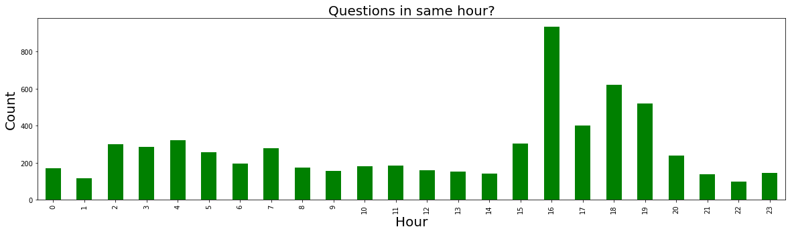

# Oppia-Gitter-EDA
Exploratory Data Analysis on Gitter channel Oppia
**Exploratory Data Analysis**** ****on**** ****oppia-chat**

**Questions to Solve:**

1. Number of Contributors dropping off

2. Helping with new contributors

    1. Whose helping most

    2. Ratio of helpers to askers

3. Chat responsive

4. Do people have more questions at same time

5. Contributor happiness

**Number**** of Contributors dropping off:**

After analysing the channel data from the Gitter API it was found that there are **209 **active users since 2017. And, taking threshold of inactiveness for **218** days there are **105** dropped users which is about **50.24%** of total active users since 2017.

**Helping with new contributor**

* Whose helping most

* Ratio of helpers to askers

The contributors helping most were selected from the intersection of two lists. The first list was highest number of times they were **mentioned** and the second list is compiled from number of **times** they sent message. 

  

 

The intersected list of the top-30 users from two lists is as follows

['pranavsid98', 'seanlip', 'darthgera123', 'WickedBrat', 'Nix07', 'saeedjassani', 'mdew192837', 'kevinlee12', 'andromfins', 'anookeen', 'Arunabh98', 'rachelwchen', 'ashish3805', 'shaz13', 'DubeySandeep', 'cosmicAsymmetry', 'wxyxinyu', 'YimingPan', 'jaredsilver', 'shubha1593', '1995YogeshSharma', 'SudhanvaMG']

**Ratio of helpers to askers**

In progress. The ratio of number of questions to normal text chat is** 29.2%**

(Here, a **question** is defined as: …)

**Chat responsiveness**

Responsiveness as of now is plotted as **readBy** (number count) of users vs **Day**. 

(E.g. the first bar means: 250 person-saw-a-message events were recorded on the first day of all twelve months of 2017.)

(0 is Monday, 6 is Sunday)

**Do people have more questions at same time**

Yes, people seems to have more questions in **16th** hour UTC (around 10-11 pm IST, 9 am PST, 12 pm EST).

**Contributor happiness**

The users seen in this word cloud are nearest neighbours of happiness. Or happiness contributor at Oppia.

(Methodology: comment text was broken into clusters, and the following is the cluster that looked most like "happy".)

